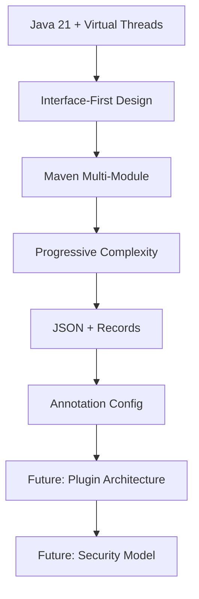

# Architecture Decision Records

This directory contains Architecture Decision Records (ADRs) for the Jentic project. ADRs are documents that capture important architectural decisions made during the development of the project, along with their context and consequences.

## ADR Index

| # | Title | Status | Date       |
|---|-------|---------|------------|
| [ADR-001](docs/adr/ADR-001-use-java-21-with-virtual-threads.md) | Use Java 21 with Virtual Threads | Accepted | 2025-09-16 |
| [ADR-002](docs/adr/ADR-002-interface-first-architecture.md) | Interface-First Architecture | Accepted | 2025-09-16 |
| [ADR-003](docs/adr/ADR-003-maven-multi-module-structure.md) | Maven Multi-Module Structure | Accepted | 2025-09-16 |
| [ADR-004](docs/adr/ADR-004-progressive-complexity-strategy.md) | Progressive Complexity Strategy | Accepted | 2025-09-16 |
| [ADR-005](docs/adr/ADR-005-json-message-format-with-records.md) | JSON Message Format with Records | Accepted | 2025-09-16 |
| [ADR-006](docs/adr/ADR-006-annotation-based-agent-configuration.md) | Annotation-Based Agent Configuration | Accepted | 2025-09-16 |

---


## How to Use This ADR Collection

### For Developers

1. **Before Making Architectural Changes**: Read relevant ADRs to understand current decisions
2. **When Proposing Changes**: Create new ADR or update existing one
3. **During Code Reviews**: Reference ADRs to justify architectural choices
4. **When Onboarding**: ADRs provide context for why things are built this way

### For Contributors

1. **Understanding Decisions**: ADRs explain the "why" behind architectural choices
2. **Proposing Alternatives**: Create ADR to document alternative approaches
3. **Maintaining Consistency**: Use ADRs to ensure consistent decision-making

### ADR Lifecycle

1. **Proposed**: New ADR under discussion
2. **Accepted**: Decision made and implemented
3. **Deprecated**: Superseded by newer decision
4. **Rejected**: Considered but not adopted

## ADR Template

When creating new ADRs, use this template:

```markdown
# ADR-XXX: [Title]

**Status**: [Proposed/Accepted/Deprecated/Rejected]  
**Date**: YYYY-MM-DD  
**Authors**: [List of authors]  
**Replaces**: [ADR number if replacing an existing decision]  
**Replaced By**: [ADR number if this decision was superseded]  

## Context

[Describe the forces at play, including technological, political, social, and project local. These forces are probably in tension, and should be called out as such.]

## Decision

[State the architecture decision and provide rationale.]

## Rationale

### Pros
- [List benefits of this approach]

### Cons  
- [List drawbacks and trade-offs]

### Alternatives Considered
- **Alternative 1**: [Brief description and why it was rejected]
- **Alternative 2**: [Brief description and why it was rejected]

## Implementation

[Provide concrete examples, code snippets, or configuration that demonstrates the decision.]

## Consequences

### Positive
- [List positive consequences]

### Negative
- [List negative consequences]

### Neutral
- [List neutral consequences that are neither clearly positive nor negative]

## Compliance

[How will adherence to this decision be monitored and enforced?]

## Notes

[Any additional notes, references, or related information]
```

---

## Upcoming ADR Topics

These architectural decisions are under consideration for future ADRs:

### ADR-007: Error Handling Strategy
**Topic**: Standardized error handling across the framework  
**Considerations**: Exception types, error propagation, retry mechanisms  
**Status**: Under Discussion

### ADR-008: Configuration Management
**Topic**: External configuration system design  
**Considerations**: YAML vs Properties, environment-specific config, secrets management  
**Status**: Proposed

### ADR-009: Logging and Observability
**Topic**: Logging strategy and metrics collection  
**Considerations**: Structured logging, distributed tracing, performance metrics  
**Status**: Research Phase

### ADR-010: Testing Strategy  
**Topic**: Testing approaches for multi-agent systems  
**Considerations**: Unit vs integration tests, agent lifecycle testing, message flow testing  
**Status**: Proposed

### ADR-011: Plugin Architecture
**Topic**: Extensibility mechanism for third-party components  
**Considerations**: SPI, dependency injection, plugin lifecycle  
**Status**: Future

### ADR-012: Security Model
**Topic**: Authentication, authorization, and secure communication  
**Considerations**: Agent identity, message encryption, access control  
**Status**: Future

### ADR-013: Performance Monitoring
**Topic**: Built-in performance monitoring and profiling  
**Considerations**: JVM metrics, agent-specific metrics, alerting  
**Status**: Future

### ADR-014: Deployment Strategies
**Topic**: Recommended deployment patterns  
**Considerations**: Single JVM, distributed, containerized, cloud-native  
**Status**: Future

---

## Decision History

### Major Architectural Phases

**Phase 1 - Foundation (ADR-001 to ADR-006)**
- Established core technology choices
- Defined modular architecture
- Set development principles

**Phase 2 - Implementation (ADR-007 to ADR-010) - Planned**
- Define implementation standards
- Establish quality practices
- Set operational guidelines

**Phase 3 - Enterprise (ADR-011 to ADR-014) - Future**
- Advanced features and extensibility
- Production-ready capabilities
- Enterprise integration patterns

### Technology Evolution



### Decision Dependencies

- **ADR-001** (Java 21) enables **ADR-005** (Records)
- **ADR-002** (Interfaces) enables **ADR-004** (Progressive Complexity)
- **ADR-003** (Maven Modules) supports **ADR-002** (Interface Architecture)
- **ADR-006** (Annotations) builds on **ADR-005** (Message Format)

---

## References and Further Reading

### External Resources

- [Architecture Decision Records (ADRs)](https://adr.github.io/)
- [Java 21 Documentation](https://docs.oracle.com/en/java/javase/21/)
- [Project Loom Documentation](https://openjdk.org/projects/loom/)
- [Maven Multi-Module Best Practices](https://maven.apache.org/guides/mini/guide-multiple-modules.html)

### Related Projects

- [JADE Framework](https://jade.tilab.com/) - Original inspiration
- [Spring Framework](https://spring.io/) - Architecture patterns
- [Akka](https://akka.io/) - Actor model implementation
- [Vert.x](https://vertx.io/) - Reactive applications

### Internal Documentation

- [Architecture Overview](docs/architecture.md)
- [Agent Development Guide](docs/agent-development.md)
- [Configuration Reference](docs/configuration.md)

---


> 💡 **Note**: ADRs are living documents. As Jentic evolves, these decisions may be revisited and updated. Always check the status and date of each ADR to ensure you're working with current architectural decisions.