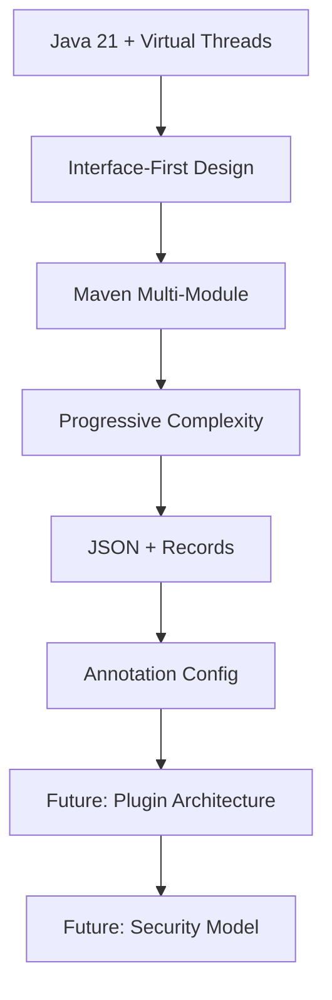

# Architecture Decision Records

This directory contains Architecture Decision Records (ADRs) for the Jentic project. ADRs are documents that capture important architectural decisions made during the development of the project, along with their context and consequences.

## ADR Index

| # | Title | Status | Date       |
|---|-------|---------|------------|
| [ADR-001](adr-001-java-21-virtual-threads.md) | Use Java 21 with Virtual Threads | Accepted | 2025-09-16 |
| [ADR-002](adr-002-interface-first-design.md) | Interface-First Architecture | Accepted | 2025-09-16 |
| [ADR-003](adr-003-maven-multi-module.md) | Maven Multi-Module Structure | Accepted | 2025-09-16 |
| [ADR-004](adr-004-progressive-complexity.md) | Progressive Complexity Strategy | Accepted | 2025-09-16 |
| [ADR-005](adr-005-message-format.md) | JSON Message Format with Records | Accepted | 2025-09-16 |
| [ADR-006](adr-006-annotation-based-config.md) | Annotation-Based Agent Configuration | Accepted | 2025-09-16 |

---

## ADR-001: Use Java 21 with Virtual Threads

**Status**: Accepted  
**Date**: 2025-09-16  
**Authors**: Project Team  

### Context

Jentic aims to modernize multi-agent systems from the JADE era. We need to choose a Java version that provides modern concurrency features while maintaining reasonable compatibility.

### Decision

We will use **Java 21 LTS with Virtual Threads (Project Loom)** as the baseline for Jentic.

### Rationale

**Pros:**
- **Virtual Threads**: Perfect for agent systems where thousands of lightweight concurrent tasks are common
- **LTS Version**: Long-term support ensures stability
- **Modern Language Features**: Records, pattern matching, improved switch expressions
- **Performance**: Better garbage collection and JVM optimizations
- **Concurrency**: Simplified concurrent programming model

**Cons:**
- **Adoption**: Slower enterprise adoption compared to Java 17
- **Tooling**: Some tools may have limited Java 21 support initially

### Implementation

```java
// Virtual threads make agent behaviors naturally concurrent
@JenticBehavior(type = CYCLIC, interval = "1s")
public void periodicTask() {
    // Each behavior runs in its own virtual thread
    // No need to manage thread pools
}

// Message handling is non-blocking
public CompletableFuture<Void> handleMessage(Message message) {
    return CompletableFuture.runAsync(() -> {
        // Process message
    }, Thread.ofVirtual().factory());
}
```

### Consequences

- **Positive**: Simplified concurrency model for agent behaviors
- **Positive**: Better resource utilization with thousands of agents
- **Positive**: Modern language features improve code quality
- **Negative**: Requires Java 21+ runtime environment
- **Negative**: May limit adoption in conservative environments

---

## ADR-002: Interface-First Architecture

**Status**: Accepted  
**Date**: 2025-09-16  
**Authors**: Project Team  

### Context

We want Jentic to be extensible and allow evolution from simple implementations to enterprise-grade solutions without breaking changes.

### Decision

We will use an **Interface-First Architecture** where all core components are defined as interfaces, with multiple implementation strategies.

### Rationale

**Benefits:**
- **Extensibility**: Easy to add new implementations (Kafka, Consul, etc.)
- **Testing**: Easy to mock and test components in isolation
- **Evolution**: Can start simple and upgrade implementations
- **Decoupling**: Loose coupling between components

**Trade-offs:**
- **Initial Complexity**: More files and abstractions upfront
- **Learning Curve**: Developers need to understand the abstraction layers

### Implementation

```java
// Core interfaces in jentic-core
public interface MessageService {
    CompletableFuture<Void> send(Message message);
    String subscribe(String topic, MessageHandler handler);
}

// Simple implementation in jentic-runtime
public class InMemoryMessageService implements MessageService {
    // In-memory implementation using ConcurrentHashMap
}

// Advanced implementation in jentic-adapters
public class KafkaMessageService implements MessageService {
    // Kafka-based implementation
}
```

### Implementation Strategy

1. **Phase 1**: Define interfaces in `jentic-core`
2. **Phase 2**: Implement basic versions in `jentic-runtime`
3. **Phase 3**: Add enterprise implementations in `jentic-adapters`
4. **Phase 4**: Allow custom implementations via SPI

### Consequences

- **Positive**: Clear separation of concerns
- **Positive**: Easy to test and mock
- **Positive**: Smooth migration path to enterprise features
- **Negative**: More initial boilerplate
- **Negative**: Potential over-abstraction

---

## ADR-003: Maven Multi-Module Structure

**Status**: Accepted  
**Date**: 2025-09-16  
**Authors**: Project Team  

### Context

We need a build structure that supports modular development, clear dependency management, and progressive feature adoption.

### Decision

We will use a **Maven Multi-Module structure** with clear module boundaries and dependency rules.

### Module Structure

```
jentic/
├── jentic-core/          # Core interfaces only
├── jentic-runtime/       # Basic implementations  
├── jentic-adapters/      # Enterprise implementations
├── jentic-examples/      # Usage examples
└── jentic-tools/         # CLI and utilities
```

### Dependency Rules

1. **jentic-core**: No dependencies (except Jackson for serialization)
2. **jentic-runtime**: Depends only on jentic-core + minimal Spring
3. **jentic-adapters**: Depends on jentic-core + external systems
4. **jentic-examples**: Can depend on any module
5. **jentic-tools**: Depends on jentic-runtime

### Benefits

- **Clear Boundaries**: Each module has specific responsibility
- **Dependency Control**: Prevents circular dependencies
- **Selective Usage**: Users can include only needed modules
- **Development Efficiency**: Team can work on modules independently

### Build Configuration

```xml
<!-- Parent POM manages versions -->
<properties>
    <maven.compiler.source>21</maven.compiler.source>
    <maven.compiler.target>21</maven.compiler.target>
    <spring.boot.version>3.2.2</spring.boot.version>
</properties>

<!-- Modules inherit consistent configuration -->
<modules>
    <module>jentic-core</module>
    <module>jentic-runtime</module>
    <module>jentic-adapters</module>
    <module>jentic-examples</module>
    <module>jentic-tools</module>
</modules>
```

### Consequences

- **Positive**: Clear module boundaries and responsibilities
- **Positive**: Easier testing and CI/CD
- **Positive**: Users can choose their complexity level
- **Negative**: Initial setup complexity
- **Negative**: More files to maintain

---

## ADR-004: Progressive Complexity Strategy

**Status**: Accepted  
**Date**: 2025-09-16  
**Authors**: Project Team  

### Context

Different users have different needs - from simple prototypes to enterprise production systems. We want to accommodate both without forcing complexity on simple use cases.

### Decision

We will implement a **Progressive Complexity Strategy** where users can start simple and evolve to more sophisticated implementations as needed.

### Evolution Path

```
Level 1: In-Memory     → Level 2: Persistent    → Level 3: Distributed
├─ InMemoryMessage     → ├─ JmsMessageService   → ├─ KafkaMessageService
├─ LocalDirectory      → ├─ DatabaseDirectory   → ├─ ConsulDirectory  
└─ SimpleScheduler     → └─ QuartzScheduler     → └─ KubernetesScheduler
```

### Implementation Strategy

1. **Start Simple**: MVP uses in-memory implementations
2. **Add Persistence**: V1.1 adds database and JMS options
3. **Scale Distributed**: V1.2 adds Kafka, Consul, etc.
4. **Cloud Native**: V2.0 adds Kubernetes, service mesh support

### Configuration Evolution

```yaml
# Level 1: Minimal configuration
jentic:
  messaging:
    provider: in-memory

# Level 2: Adding persistence  
jentic:
  messaging:
    provider: database
    properties:
      url: jdbc:postgresql://localhost/jentic

# Level 3: Distributed systems
jentic:
  messaging:
    provider: kafka
    properties:
      bootstrap-servers: kafka:9092
      consumer-group: jentic-agents
```

### Benefits

- **Low Barrier to Entry**: New users can start immediately
- **No Over-Engineering**: Simple use cases stay simple
- **Clear Upgrade Path**: Evolution path is documented and supported
- **Reduced Lock-In**: Users can migrate implementations without code changes

### Consequences

- **Positive**: Appeals to both beginners and enterprise users
- **Positive**: Allows organic growth of complexity
- **Positive**: Reduces initial learning curve
- **Negative**: Need to maintain multiple implementations
- **Negative**: Documentation must cover all complexity levels

---

## ADR-005: JSON Message Format with Records

**Status**: Accepted  
**Date**: 2025-09-16  
**Authors**: Project Team  

### Context

We need a message format that is human-readable, language-agnostic, performant, and leverages modern Java features.

### Decision

We will use **JSON as the message serialization format** with **Java Records** for message representation.

### Message Structure

```java
public record Message(
    String id,                    // Unique message identifier
    String topic,                 // Message topic/channel
    String senderId,              // Sending agent ID
    String receiverId,            // Target agent ID (optional)
    String correlationId,         // For request/response patterns
    Object content,               // Message payload
    Map<String, String> headers,  // Additional metadata
    Instant timestamp             // Message creation time
) {
    // Builder pattern and utility methods
}
```

### Serialization

- **Library**: Jackson (widely adopted, excellent performance)
- **Format**: JSON (human-readable, debugging-friendly)
- **Types**: Full support for Java time types, collections
- **Compatibility**: Cross-language interoperability

### Benefits

- **Immutability**: Records are immutable by default
- **Conciseness**: Less boilerplate compared to traditional classes
- **Performance**: Jackson handles records efficiently
- **Debugging**: JSON is human-readable
- **Interoperability**: JSON works with any language

### Message Examples

```json
{
  "id": "msg-12345",
  "topic": "weather.data",
  "senderId": "weather-agent-1",
  "content": {
    "location": "Rome",
    "temperature": 22.5,
    "humidity": 65
  },
  "headers": {
    "content-type": "weather-data",
    "priority": "normal"
  },
  "timestamp": "2024-03-15T10:30:00Z"
}
```

### Consequences

- **Positive**: Modern, immutable, concise message representation
- **Positive**: Human-readable format aids debugging
- **Positive**: Cross-language compatibility
- **Positive**: Excellent tooling support
- **Negative**: Slightly larger than binary formats
- **Negative**: JSON parsing overhead (acceptable for most use cases)

---

## ADR-006: Annotation-Based Agent Configuration

**Status**: Accepted  
**Date**: 2025-09-16  
**Authors**: Project Team  

### Context

We want agent configuration to be declarative, close to the code, and easy to understand, while maintaining the flexibility for external configuration.

### Decision

We will use **Annotation-Based Configuration** as the primary mechanism for defining agent behavior, supplemented by external YAML configuration.

### Annotation Design

```java
@JenticAgent(value = "weather-station", 
             type = "sensor", 
             capabilities = {"data-collection", "weather-monitoring"},
             autoStart = true)
public class WeatherStationAgent extends BaseAgent {
    
    @JenticBehavior(type = CYCLIC, 
                    interval = "30s", 
                    initialDelay = "10s",
                    autoStart = true)
    public void collectWeatherData() {
        // Periodic data collection
    }
    
    @JenticMessageHandler("weather.request")
    public void handleWeatherRequest(Message message) {
        // Handle incoming requests
    }
}
```

### Configuration Hierarchy

1. **Annotations**: Default behavior, close to code
2. **YAML Config**: Override annotations, environment-specific
3. **System Properties**: Override YAML, deployment-specific
4. **Environment Variables**: Override system properties, container-friendly

### Benefits

- **Co-location**: Configuration lives with the code
- **Type Safety**: Compile-time validation of configuration
- **IDE Support**: Auto-completion and refactoring support
- **Self-Documenting**: Configuration is visible in the code
- **Flexibility**: Can be overridden externally

### External Override Example

```yaml
jentic:
  agents:
    weather-station:
      behaviors:
        collectWeatherData:
          interval: "60s"  # Override annotation default
      message-handlers:
        weather.request:
          auto-subscribe: false
```

### Discovery Mechanism

```java
// Runtime scans for @JenticAgent annotations
@Component
public class AnnotationAgentScanner {
    
    public Set<Class<?>> scanForAgents(String basePackage) {
        // Use reflection to find annotated classes
        return reflections.getTypesAnnotatedWith(JenticAgent.class);
    }
}
```

### Consequences

- **Positive**: Configuration close to code reduces mistakes
- **Positive**: IDE support improves developer experience
- **Positive**: Type-safe configuration
- **Positive**: Self-documenting code
- **Negative**: Requires recompilation for configuration changes
- **Negative**: May encourage hard-coding of environment-specific values
- **Mitigation**: External configuration can override annotations

---

## How to Use This ADR Collection

### For Developers

1. **Before Making Architectural Changes**: Read relevant ADRs to understand current decisions
2. **When Proposing Changes**: Create new ADR or update existing one
3. **During Code Reviews**: Reference ADRs to justify architectural choices
4. **When Onboarding**: ADRs provide context for why things are built this way

### For Contributors

1. **Understanding Decisions**: ADRs explain the "why" behind architectural choices
2. **Proposing Alternatives**: Create ADR to document alternative approaches
3. **Maintaining Consistency**: Use ADRs to ensure consistent decision-making

### ADR Lifecycle

1. **Proposed**: New ADR under discussion
2. **Accepted**: Decision made and implemented
3. **Deprecated**: Superseded by newer decision
4. **Rejected**: Considered but not adopted

## ADR Template

When creating new ADRs, use this template:

```markdown
# ADR-XXX: [Title]

**Status**: [Proposed/Accepted/Deprecated/Rejected]  
**Date**: YYYY-MM-DD  
**Authors**: [List of authors]  
**Replaces**: [ADR number if replacing an existing decision]  
**Replaced By**: [ADR number if this decision was superseded]  

## Context

[Describe the forces at play, including technological, political, social, and project local. These forces are probably in tension, and should be called out as such.]

## Decision

[State the architecture decision and provide rationale.]

## Rationale

### Pros
- [List benefits of this approach]

### Cons  
- [List drawbacks and trade-offs]

### Alternatives Considered
- **Alternative 1**: [Brief description and why it was rejected]
- **Alternative 2**: [Brief description and why it was rejected]

## Implementation

[Provide concrete examples, code snippets, or configuration that demonstrates the decision.]

## Consequences

### Positive
- [List positive consequences]

### Negative
- [List negative consequences]

### Neutral
- [List neutral consequences that are neither clearly positive nor negative]

## Compliance

[How will adherence to this decision be monitored and enforced?]

## Notes

[Any additional notes, references, or related information]
```

---

## Upcoming ADR Topics

These architectural decisions are under consideration for future ADRs:

### ADR-007: Error Handling Strategy
**Topic**: Standardized error handling across the framework  
**Considerations**: Exception types, error propagation, retry mechanisms  
**Status**: Under Discussion

### ADR-008: Configuration Management
**Topic**: External configuration system design  
**Considerations**: YAML vs Properties, environment-specific config, secrets management  
**Status**: Proposed

### ADR-009: Logging and Observability
**Topic**: Logging strategy and metrics collection  
**Considerations**: Structured logging, distributed tracing, performance metrics  
**Status**: Research Phase

### ADR-010: Testing Strategy  
**Topic**: Testing approaches for multi-agent systems  
**Considerations**: Unit vs integration tests, agent lifecycle testing, message flow testing  
**Status**: Proposed

### ADR-011: Plugin Architecture
**Topic**: Extensibility mechanism for third-party components  
**Considerations**: SPI, dependency injection, plugin lifecycle  
**Status**: Future

### ADR-012: Security Model
**Topic**: Authentication, authorization, and secure communication  
**Considerations**: Agent identity, message encryption, access control  
**Status**: Future

### ADR-013: Performance Monitoring
**Topic**: Built-in performance monitoring and profiling  
**Considerations**: JVM metrics, agent-specific metrics, alerting  
**Status**: Future

### ADR-014: Deployment Strategies
**Topic**: Recommended deployment patterns  
**Considerations**: Single JVM, distributed, containerized, cloud-native  
**Status**: Future

---

## Decision History

### Major Architectural Phases

**Phase 1 - Foundation (ADR-001 to ADR-006)**
- Established core technology choices
- Defined modular architecture
- Set development principles

**Phase 2 - Implementation (ADR-007 to ADR-010) - Planned**
- Define implementation standards
- Establish quality practices
- Set operational guidelines

**Phase 3 - Enterprise (ADR-011 to ADR-014) - Future**
- Advanced features and extensibility
- Production-ready capabilities
- Enterprise integration patterns

### Technology Evolution



### Decision Dependencies

- **ADR-001** (Java 21) enables **ADR-005** (Records)
- **ADR-002** (Interfaces) enables **ADR-004** (Progressive Complexity)
- **ADR-003** (Maven Modules) supports **ADR-002** (Interface Architecture)
- **ADR-006** (Annotations) builds on **ADR-005** (Message Format)

---

## References and Further Reading

### External Resources

- [Architecture Decision Records (ADRs)](https://adr.github.io/)
- [Java 21 Documentation](https://docs.oracle.com/en/java/javase/21/)
- [Project Loom Documentation](https://openjdk.org/projects/loom/)
- [Maven Multi-Module Best Practices](https://maven.apache.org/guides/mini/guide-multiple-modules.html)

### Related Projects

- [JADE Framework](https://jade.tilab.com/) - Original inspiration
- [Spring Framework](https://spring.io/) - Architecture patterns
- [Akka](https://akka.io/) - Actor model implementation
- [Vert.x](https://vertx.io/) - Reactive applications

### Internal Documentation

- [Architecture Overview](../docs/architecture.md)
- [Development Guide](../docs/development.md)
- [Migration from JADE](../docs/migration-from-jade.md)

---

**Last Updated**: 2025-09-16  


> 💡 **Note**: ADRs are living documents. As Jentic evolves, these decisions may be revisited and updated. Always check the status and date of each ADR to ensure you're working with current architectural decisions.